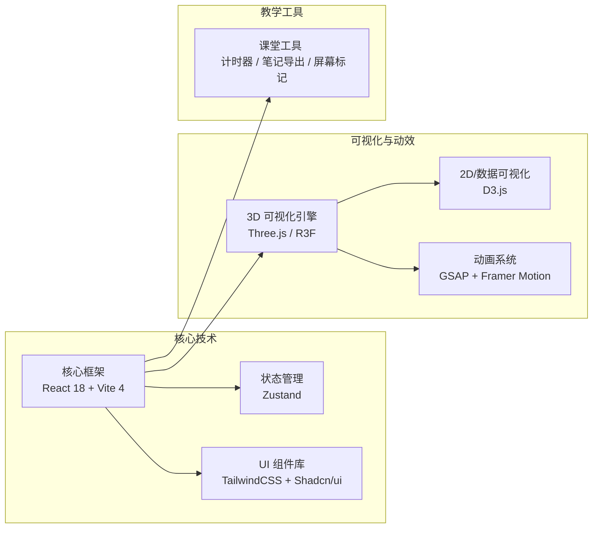

# 12306-teacher
# 12306 高并发系统可视化教学平台

## 🚀 项目定位

**12306高并发系统可视化教学平台** 是一个专为教育场景设计的互动学习沙盒。

### 核心使命
帮助教师向学生生动地、具象化地展示高并发系统（如12306春运抢票）的工作原理，提供“所见即所得”的沉浸式学习体验。

### 关键原则
1.  **零配置使用**：教师开箱即用，无需复杂的技术背景或环境配置。
2.  **沉浸式学习**：所有核心技术概念，如负载均衡、削峰填谷、分库分表等，都通过可视化交互具象呈现。
3.  **教学友好**：内置课堂控制工具（如计时器、场景切换、笔记导出），完美适配45分钟的标准课时结构。
4.  **安全无依赖**：纯前端实现，不涉及后端服务，学生在浏览器中即可完成所有实验，无需登录或共享个人数据。

---

## 🛠️ 技术栈架构

本平台采用现代化的前端技术栈构建，以实现高性能的可视化与流畅的交互体验。



---

## ✨ 核心功能模块

平台包含多个核心实验模块，每个模块都聚焦于高并发系统的一个特定方面。

### 1. 春运剧场 (Spring Festival Theater)
模拟春运期间的宏观客流与购票请求。
- **3D中国地图粒子系统**：可视化展示主要城市节点、高铁线路网络以及实时的购票请求脉冲。
- **教学引导系统**：AI助教（`TeachingAssistant`）引导学生理解当前场景。
- **课堂计时控制台**：教师用于控制课堂节奏，切换不同教学环节。
- **场景切换**：教师可一键切换“日常模式”、“春运高峰”和“故障测试”等不同压力场景。

### 2. 余票分配实验室 (Ticket Allocation Lab)
深入探索12306核心的票务分配算法。
- **动态算法流程图**：使用D3.js展示票池分割、需求预测、冲突检测等算法步骤。
- **3D车厢可视化器**：实时观察不同分配策略下，座位被占用的过程。
- **教学控制面板**：允许教师或学生切换不同的分配算法（如轮询、优先级、智能预测），对比其效果。

### 3. 高并发实验室 (Concurrency Lab)
模拟海量请求冲击下的系统行为。
- **粒子压力模拟系统**：用不同颜色和速度的粒子代表不同状态的请求（正常、峰值、排队）。
- **算法对比实验台**：并排可视化展示“令牌桶”、“虚拟队列”等限流/排队算法的吞吐量、延迟和错误率。
- **故障注入面板**：教师可以手动注入网络延迟、服务器崩溃、数据库死锁等故障，观察系统的反应和恢复过程。

### 4. 视频学习中心 (Video Learning Hub)
提供配套的微课视频和学习工具。
- **智能视频播放器**：带有章节、互动问答和关键概念提示的视频播放器。
- **课堂笔记编辑器**：支持模板化笔记记录和一键导出（PDF/Markdown）。

### 5. 教师控制中枢 (Instructor Dashboard)
为教师提供全局的课堂管理能力。
- **课堂节拍器**：控制45分钟课堂各环节的时间。
- **学生进度监控**：(未来功能) 实时了解学生对知识点的掌握程度。
- **教学工具箱**：屏幕标记、实验快照、数据记录等辅助工具。

---

## 🎨 设计系统

### 色彩体系
- **主色调**：科技蓝 (`#2563eb`) + 中国红 (`#dc2626`)
- **辅助色**：数据紫 (`#7c3aed`) + 算法青 (`#0891b2`)

### 字体规范
- **标题**：Alibaba Sans Bold
- **正文**：Geist Sans

### 空间与动效
- **布局**：基于8px基线网格的动态间距系统。
- **动效体系**：通过光脉冲、粒子轨迹、热力图等效果，将抽象的数据流动和算法流程变得生动直观。

---

## 🚀 快速开始

1. **克隆项目**
   ```bash
   git clone https://github.com/your-repo/edu-lab.git
   cd edu-lab
   ```

2. **安装依赖**
   ```bash
   npm install
   ```
   
3. **安装核心可视化库**
   ```bash
   npm install @react-three/fiber @react-three/drei three d3 gsap framer-motion zustand tailwindcss postcss autoprefixer
   ```

4. **运行开发环境**
   ```bash
   npm run dev
   ```

打开浏览器访问 `http://localhost:5173` (或Vite指定的端口) 即可开始。 
